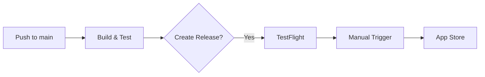

# App Store Deployment Guide

Complete guide for deploying the RideLink mobility_app to the Apple App Store.

---

## Table of Contents

1. [Prerequisites](#prerequisites)
2. [Apple Developer Account Setup](#apple-developer-account-setup)
3. [App Store Connect Configuration](#app-store-connect-configuration)
4. [Fastlane Match Setup](#fastlane-match-setup)
5. [GitHub Secrets Configuration](#github-secrets-configuration)
6. [Deployment Commands](#deployment-commands)
7. [CI/CD Workflows](#cicd-workflows)
8. [Submission Checklist](#submission-checklist)
9. [Common Rejection Reasons](#common-rejection-reasons)
10. [Troubleshooting](#troubleshooting)

---

## Prerequisites

### Required Accounts
- [ ] Apple Developer Program membership ($99/year) - [Enroll here](https://developer.apple.com/programs/enroll/)
- [ ] App Store Connect access
- [ ] GitHub repository with Actions enabled

### Local Development Tools
```bash
# Install Xcode (via Mac App Store)
xcode-select --install

# Install Ruby (for Fastlane)
brew install ruby

# Install Fastlane dependencies
cd ios
bundle install
```

### Current App Configuration
| Setting | Value |
|---------|-------|
| Bundle ID | `com.easymo.mobilityApp` |
| Minimum iOS | 13.0 |
| Swift Version | 5.0 |

---

## Apple Developer Account Setup

### 1. Create App ID

1. Go to [Apple Developer Portal](https://developer.apple.com/account/resources/identifiers/list)
2. Click **"+"** → **"App IDs"** → **"App"**
3. Enter:
   - **Description**: RideLink
   - **Bundle ID**: `com.easymo.mobilityApp` (Explicit)
4. Enable required capabilities:
   - [ ] Push Notifications
   - [ ] Sign in with Apple (if applicable)
   - [ ] Associated Domains (if using deep links)
5. Click **"Continue"** → **"Register"**

### 2. Get Your Team ID

1. Go to [Membership page](https://developer.apple.com/account#MembershipDetailsCard)
2. Copy your **Team ID** (10-character string like `ABCD123456`)

---

## App Store Connect Configuration

### 1. Create App in App Store Connect

1. Go to [App Store Connect](https://appstoreconnect.apple.com/apps)
2. Click **"+"** → **"New App"**
3. Fill in:
   - **Platforms**: iOS
   - **Name**: RideLink (or your app name)
   - **Primary Language**: English
   - **Bundle ID**: Select `com.easymo.mobilityApp`
   - **SKU**: `com.easymo.mobilityApp` (or any unique identifier)
   - **User Access**: Full Access

### 2. Create App Store Connect API Key

> [!IMPORTANT]
> API Keys are the recommended authentication method for CI/CD. They don't require 2FA and are more secure than passwords.

1. Go to [Users and Access → Keys](https://appstoreconnect.apple.com/access/api)
2. Click **"+"** to create a new key
3. Enter:
   - **Name**: `RideLink CI/CD`
   - **Access**: `App Manager` (or `Admin` for full access)
4. Click **"Generate"**
5. **Download the .p8 file immediately** (only available once!)
6. Note down:
   - **Key ID**: Shown in the list (e.g., `ABC123DEFG`)
   - **Issuer ID**: Shown at the top of the page (e.g., `12345678-1234-1234-1234-123456789012`)

### 3. Prepare API Key for CI/CD

```bash
# Convert .p8 file to base64 for GitHub Secrets
base64 -i AuthKey_ABC123DEFG.p8 | pbcopy
# This copies the base64 string to clipboard
```

---

## Fastlane Match Setup

Fastlane Match manages your certificates and provisioning profiles in a Git repository.

### 1. Create Certificate Repository

1. Create a **private** GitHub repository (e.g., `yourorg/ios-certificates`)
2. Generate a deploy key:
   ```bash
   ssh-keygen -t ed25519 -C "fastlane-match" -f ~/.ssh/match_deploy_key
   ```
3. Add the public key to the repo as a deploy key with write access
4. Configure SSH to use this key for the match repo

### 2. Initialize Match

```bash
cd ios

# Initialize Match with your certificate repo
bundle exec fastlane match init

# When prompted:
# - Storage mode: git
# - URL: git@github.com:yourorg/ios-certificates.git
```

### 3. Generate Certificates

```bash
# Development certificates (for testing on devices)
bundle exec fastlane match development

# App Store certificates (for distribution)
bundle exec fastlane match appstore

# When prompted, enter a passphrase for encrypting the certificates
# SAVE THIS PASSWORD - you'll need it for MATCH_PASSWORD secret
```

### 4. Verify Setup

```bash
# List all lanes
bundle exec fastlane lanes

# Check version info
bundle exec fastlane version_info
```

---

## GitHub Secrets Configuration

Go to **GitHub → Repository → Settings → Secrets and variables → Actions**

### Required Secrets

| Secret Name | Description | How to Get |
|-------------|-------------|------------|
| `APPLE_ID` | Apple Developer email | Your login email |
| `APPLE_TEAM_ID` | 10-char Team ID | developer.apple.com → Membership |
| `ITC_TEAM_ID` | App Store Connect Team ID | appstoreconnect.apple.com → Users and Access |
| `MATCH_PASSWORD` | Encryption passphrase | Set during `fastlane match init` |
| `MATCH_GIT_URL` | Certificate repo URL | `git@github.com:yourorg/ios-certificates.git` |
| `APP_STORE_CONNECT_API_KEY_ID` | API Key ID | From App Store Connect Keys page |
| `APP_STORE_CONNECT_API_ISSUER_ID` | Issuer ID | From App Store Connect Keys page |
| `APP_STORE_CONNECT_API_KEY_CONTENT` | Base64-encoded .p8 file | `base64 -i AuthKey_XXX.p8` |

### Optional Secrets

| Secret Name | Description |
|-------------|-------------|
| `APPLE_APP_SPECIFIC_PASSWORD` | For legacy auth (if not using API key) |
| `SLACK_WEBHOOK_URL` | For deployment notifications |

---

## Deployment Commands

### Local Deployment

```bash
cd ios

# Deploy to TestFlight
bundle exec fastlane beta

# Deploy to App Store
bundle exec fastlane release

# Deploy with options
bundle exec fastlane release submit:false  # Build only, no submission
bundle exec fastlane release auto_release:false  # Manual release after approval
```

### Version Management

```bash
# Check current version
bundle exec fastlane version_info

# Set new version
bundle exec fastlane set_version version:1.2.0

# Increment build number
bundle exec fastlane increment_build
```

### Metadata Management

```bash
# Download existing metadata
bundle exec fastlane download_metadata

# Upload metadata only (no binary)
bundle exec fastlane upload_metadata
```

---

## CI/CD Workflows

### Automatic Deployments

| Trigger | Target | Condition |
|---------|--------|-----------|
| Release created | TestFlight | `github.event_name == 'release'` |
| Manual dispatch | TestFlight | `deploy_target == 'testflight'` |
| Manual dispatch | App Store | `deploy_target == 'appstore'` |

### Manual Deployment

1. Go to **GitHub → Actions → RideLink CI/CD Pipeline**
2. Click **"Run workflow"**
3. Select:
   - **Branch**: `main`
   - **Deployment target**: `testflight` or `appstore`
4. Click **"Run workflow"**

### Release Flow



---

## Submission Checklist

### Before Submission

#### App Content
- [ ] App icon (1024x1024) added
- [ ] Screenshots for all required device sizes
- [ ] App description written
- [ ] Keywords optimized
- [ ] Privacy policy URL added
- [ ] Support URL added

#### Technical Requirements
- [ ] `flutter analyze` passes with no errors
- [ ] `flutter test` passes
- [ ] Release build succeeds: `flutter build ios --release`
- [ ] App tested on physical device
- [ ] All placeholder content removed
- [ ] No debug logs in release build

#### Privacy & Legal
- [ ] Privacy policy published online
- [ ] App Tracking Transparency handled (if tracking users)
- [ ] IDFA usage declared correctly
- [ ] Login requirements documented (if required)
- [ ] Export compliance answered

#### App Store Connect
- [ ] App preview video (optional but recommended)
- [ ] Promotional text (170 chars)
- [ ] What's New text
- [ ] Age rating questionnaire completed
- [ ] App category selected
- [ ] Pricing configured

### During Review

- Expected review time: 24-48 hours (can vary)
- Monitor App Store Connect for status updates
- Be available to respond to reviewer questions

---

## Common Rejection Reasons

### 1. Guideline 4.3 - Spam
**Issue**: App is too similar to existing apps
**Prevention**: Ensure unique value proposition and functionality

### 2. Guideline 2.1 - App Completeness
**Issue**: Crashes, bugs, or placeholder content
**Prevention**: 
- Thorough QA testing
- Remove all lorem ipsum text
- Test all user flows end-to-end

### 3. Guideline 5.1.1 - Data Collection and Storage
**Issue**: Privacy policy missing or inadequate
**Prevention**:
- Add privacy policy URL
- Clearly explain data collection
- Implement App Tracking Transparency

### 4. Guideline 2.3.3 - Accurate Screenshots
**Issue**: Screenshots don't match actual app
**Prevention**: Use `fastlane screenshot` for accurate captures

### 5. Guideline 4.2 - Minimum Functionality
**Issue**: App doesn't provide enough features
**Prevention**: Ensure core functionality is complete and useful

---

## Troubleshooting

### Certificate Issues

```bash
# Nuke all certificates and regenerate (use with caution!)
bundle exec fastlane match nuke development
bundle exec fastlane match nuke distribution

# Regenerate
bundle exec fastlane match development
bundle exec fastlane match appstore
```

### Build Failures

```bash
# Clean Flutter build
flutter clean
flutter pub get

# Clean Xcode derived data
rm -rf ~/Library/Developer/Xcode/DerivedData

# Reinstall pods
cd ios
rm -rf Pods Podfile.lock
pod install
```

### Code Signing Errors

1. Verify team ID in Matchfile matches your Apple Developer account
2. Ensure certificates aren't expired (check Apple Developer Portal)
3. Re-run `fastlane match appstore` to sync certificates

### API Key Authentication Errors

1. Verify key hasn't been revoked in App Store Connect
2. Check key permissions (needs App Manager or Admin)
3. Ensure .p8 content is correctly base64 encoded
4. Verify Issuer ID and Key ID are correct

---

## Quick Reference

### Fastlane Lanes

| Lane | Description |
|------|-------------|
| `beta` | Build and upload to TestFlight |
| `release` | Build and submit to App Store |
| `build_release` | Build only (no upload) |
| `sync_appstore_certs` | Sync App Store certificates |
| `increment_build` | Increment build number |
| `version_info` | Show current version |

### Useful Commands

```bash
# View all lanes
cd ios && bundle exec fastlane lanes

# Dry run (no actual upload)
bundle exec fastlane beta --env dry_run

# Verbose output
bundle exec fastlane beta --verbose
```

### Support Resources

- [Fastlane Documentation](https://docs.fastlane.tools/)
- [App Store Review Guidelines](https://developer.apple.com/app-store/review/guidelines/)
- [App Store Connect Help](https://help.apple.com/app-store-connect/)
- [Flutter iOS Deployment](https://docs.flutter.dev/deployment/ios)
